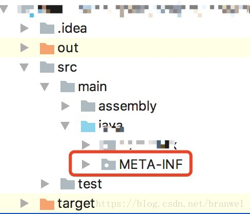
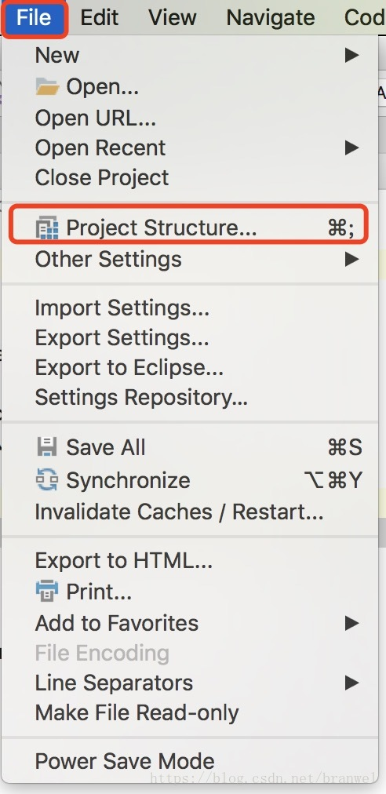
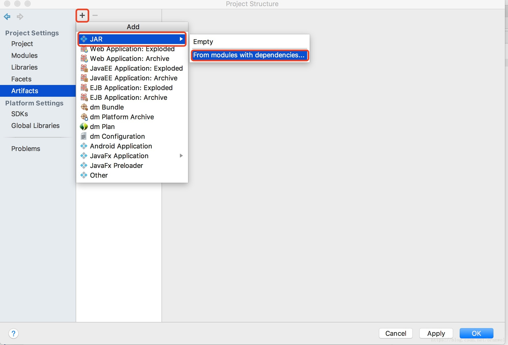
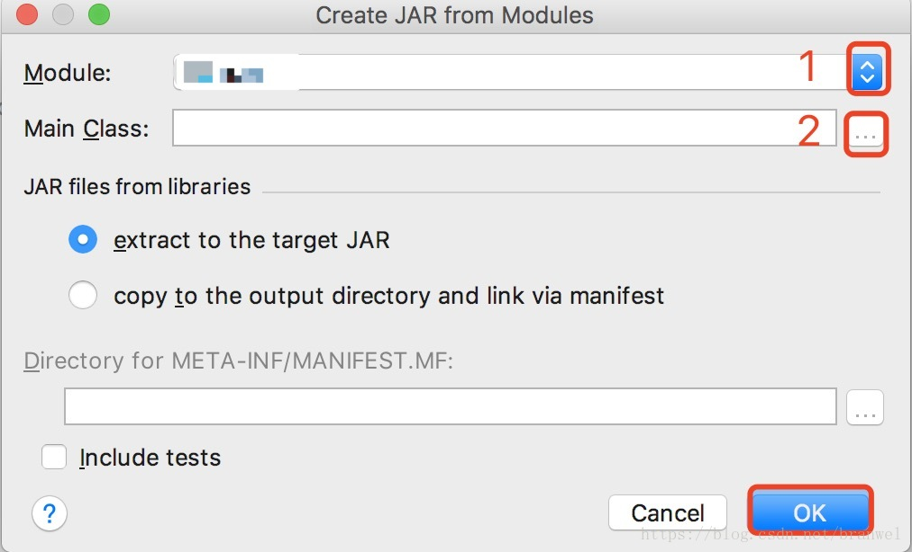
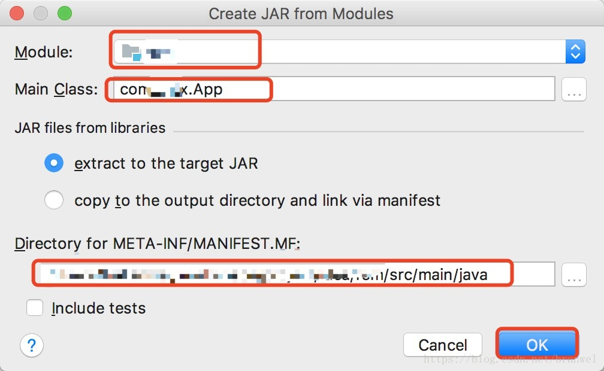
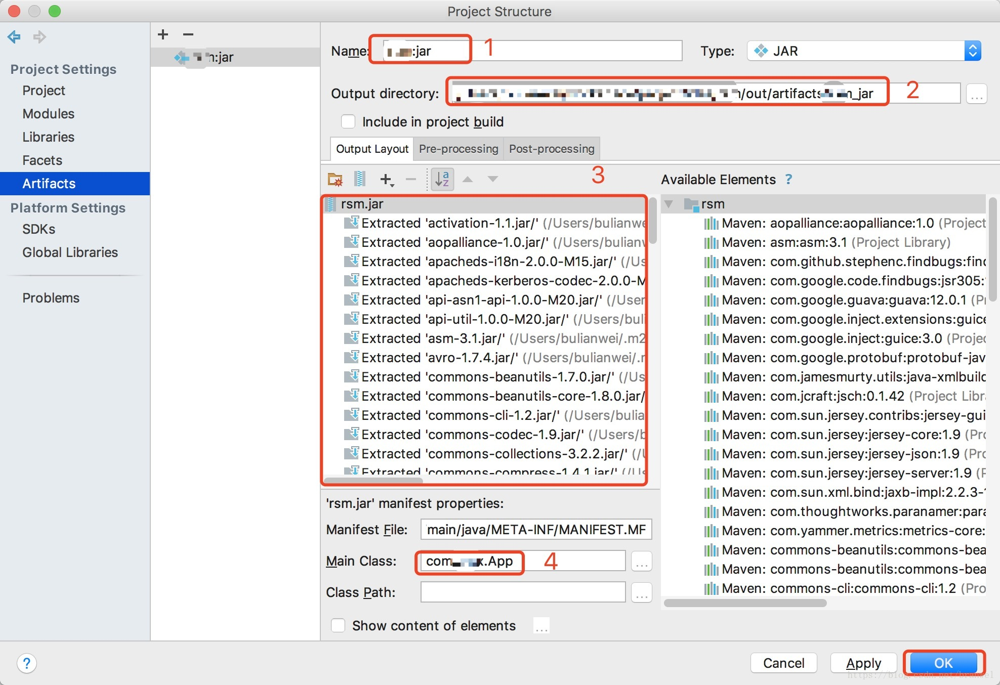

### idea运行docker-compose报错

```text
Failed to deploy ‘Compose: docker-compose.yml’: com.intellij.execution.process.ProcessNotCreatedException: Cannot run program “docker-compose” (in directory “G:\ideaWSP\test”): CreateProcess error=2, 系统找不到指定的文件。
```

- 下载docker-compose.exe软件，放到某文件夹，然后配置idea-setting-docker工具-docker compose可执行文件中的文件位置。

### IDEA+Maven打jar包

```
https://blog.csdn.net/asdfadafd/article/details/123632296
```

IDEA自带的打包工具使用打无依赖jar包

- 1.如果工程目录中有以下文件夹 删掉
  
- 2.点击工程上方【File】菜单选择【Project Structure】
  
- 3.点击【+】 选择【JAR】，【From modules with dependencies】点击【ok】
  
- 4.点击【1】选择你要打包的Module，点击【2】选择你的主类（也就是你的程序的入口）然后点击【ok】
  
- 5.点击【ok】
  
- 6.【1】是要打的jar包的名字，【2】是jar包的输出路径，不能使用默认，需要自行指定，【3】是程序所需要的jar依赖，【4】是程序主类的名称。因为这里是打没有依赖的jar包，所以将【3】里面不需要的jar包删掉就行。最后点击【ok】
  
- 7.然后就会生成一个META-INF的文件夹，里面就是一些配置属性
  打包涵依赖jar包
  对以上的方式中的步骤6中 不做任何修改，然后执行步骤7
